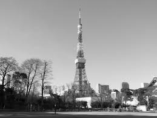
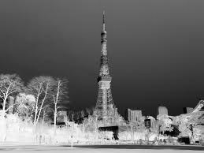
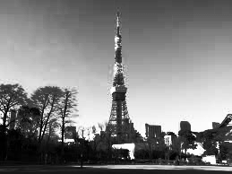
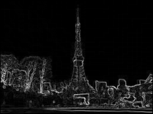

# Image-Processing-Algorithm

<!-- 

     

-->

Here is some implementation in c of digital image processing algorithm.
At the moment, these programs only work with _portable graymap file format_  (**pgm**).

## Source image

| field         | value       |
| -------      | ------------------- |
| name         | `images/Tour_Eiffel_Japon.pgm` |
| width        | `259` |
| height       | `194` |
| color depth  | `8 bit` |

## Introduction

| alorithm               | command                                 | output image                                      |
| :---:                  | :---:                                   | :---:                                             |
| negative               | `bin/negative src_img dst_img`          |           |
| Histogram Equalization | `bin/hist_equalization src_img dst_img` |  |
| Sobel                  | `bin/sobel src_img dst_img`             |              | 

